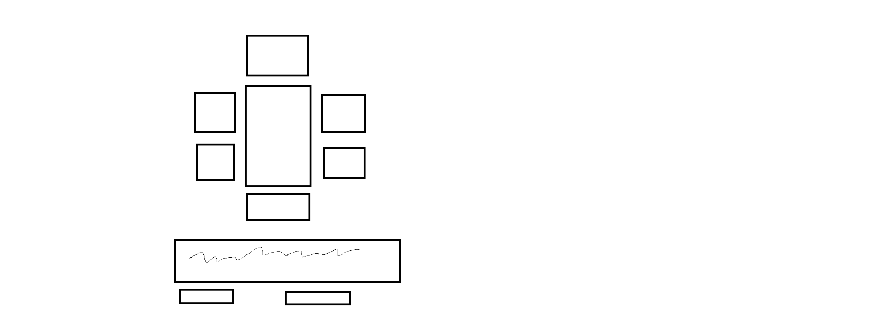

    
    

---

<h1 align="center">PLANS</h1>

1. Style en bil i steg, type diver i forskjellige farger som endres til like for å få poeng.
2. Bruke inline CSS for å endre panelfarger.
3. Poeng multiplyers ved møte av folk og riktig hilsen eller action blir valgt.
4. Bruke new View ved vinn eller lose.
5. Fult fokus på bruk av korekt MVC.
6. Delene skal ligge i liste mtp oversikt, og endringene skal bruke push og splice.

## Oppgavefordeling:
- Aleks på hoved CSS.
- Kristian starter på hvordan bygge møte på funksjonen.
- Kamilla starter med Vinn og tape view filene.
- Sander starter med å lage funskjsoner som henter ut objekt i liste.
- Kim starter med å bygge modellen og mainView.
- Julie starter med å lagen en push/splice funksjon.

## NiceToHave:
- prøve å gjøre det etter DRY.

---

<h4 align="center">Arbeidsdag: Onsdag (11.09.2024), fulldag!</h4>

---

<h3 align="center">Oppgaven</h3>
Man kjører en bil - på veien dukker det opp flere tilfeldige ting du kan velge å enten legge til på bilen eller la det vær. Noen ting øker kulhetsfaktoren på bilen, andre senker den. Noen ganger møter man også på en kompis langs veien - han må du hilse på før du kan kjøre videre.

Du har (minst) tre måter å hilse på - kompisen er bare fornøyd med én av måtene å bli hilst på. Dette er tilfeldig fra kompis til kompis og fra møte til møte hvilken hilsen som er riktig. Du må hilse riktig før du kan kjøre videre. Har du høy kulhet på bilen får du en kul hilsen tilbake fra kompisen når du hilser riktig, har du lav kulhet får du en lite kul hilsen tilbake. 

Andre ting kan også dukke opp underveis - bruk fantasien! Kanskje kommer det en aggressiv bestemor - du velger å ignorere henne og det ender med at hun klasker til bilen med vesken sin og senker kulhetsfaktoren din 

Målet er å fylle kulhet-o-meteret helt opp - da kommer det en win screen med gratulasjoner (eller kanskje en bossfight dersom man har kjørt over x antall ekorn...;))

På denne oppgaven kan det være lurt å snuse på å bruke objekter og arrays - ikke fokuser så mye på utseendet - få logikken på plass først og deretter evt CSS (f.eks bruke knapper og tekst på skjermen som beskriver hva som skjer i første omgang)
